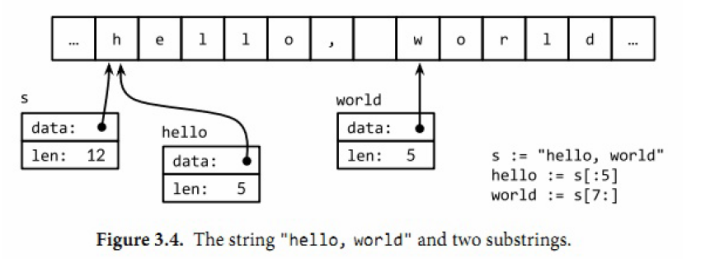

[TOC]

# 基本数据类型

​		虽然从底层而言，所有的数据都是由比特组成，但计算机一般操作的是固定大小的数，如整数、浮点数、比特数组、内存地址等。进一步将这些数组织在一起，就可表达更多的对象，例如数据包、像素点、诗歌，甚至其他任何对象。Go语言提供了丰富的数据组织形式，这依赖于Go语言内置的数据类型。这些内置的数据类型，兼顾了硬件的特性和表达复杂数据结构的便捷性。

​		Go语言将数据类型分为四类：基础类型、复合类型、引用类型和接口类型。基础类型，包括：数字、字符串和布尔型。复合数据类型：数组和结构体，是通过组合简单类型，来表达更加复杂的数据结构。引用类型包括指针、切片、字典、函数、通道，虽然数据种类很多，但它们都是对程序中一个变量或状态的间接引用。这意味着对任一引用类型数据的修改都会影响所有该引用的拷贝。(Go语言的数值类型包括整形数、浮点数和复数。每种数值类型都决定了对应的大小范围和是否支持正负符号。)

## **1 整形**

### 1.2 整形分类

​		Go语言同时提供了有符号和无符号类型的整数运算。这里有`int8、int16、int32和int64`四种截然不同大小的有符号整形数类型，分别对应8、16、32、64bit大小的有符号整形数，与此对应的是`uint8、uint16、uint32和uint64`四种无符号整形数类型。

​		还有两种依赖于CPU位数的类型：有符号和无符号整数`int和uint`，它们分别表示一个机器字长。在32位CPU上，一个机器字长为32bit，共4字节，在64位CPU上，一个机器字长为64bit，共8字节。

> 除了int和uint依赖于CPU架构，还有一种uintptr也是依赖于机器字长的。这种无符号的整数类型uintptr，没有指定具体的bit大小但是足以容纳指针。uintptr类型只有在底层编程是才需要，特别是Go语言和C语言函数库或操作系统接口相交互的地方。

| 有符号整形 | 无符号整形      | 特殊类型 |
| ---------- | --------------- | -------- |
| int8       | uint8           | byte     |
| int16      | uint16          |          |
| int32      | uint32          | rune     |
| int64      | uint64          |          |
| int        | unit            |          |
|            | uintptr（了解） |          |

### **1.2 整形兄弟类型间的类型转换**

整形中，以上涉及到的的所有子类型，都是不同类型的兄弟类型。其中int和int32也是不同的类型，即使int的大小 

```go
func main() {
	var a int = 798
	var b int32
	// b = a				//cannot use a (type int) as type int32 in assignment
    b = int32(a)
	fmt.Println(b)
}
```

### **1.3 整形的不同进制表示**

在整数加上0前缀表示这是8进制，例如`077`。加上前缀0x表示这是16进制，例如`0x0c`，使用e符号可以表示这是一个科学计数法，如`1e3 = 1000`,`6.023e23 = 6.023 x 10^23`。

```go
func main() {
    // 十进制表示方法
	var a int = 798
	fmt.Printf("%d\n", a) //798
	fmt.Printf("%b\n", a) //1100011110
	fmt.Printf("%o\n", a) //1436
	fmt.Printf("%x\n", a) //31e
    
    // 八进制表示方法：在整数加上0前缀
	var b = 077
	fmt.Printf("%d\n", b) //63		十进制
	fmt.Printf("%b\n", b) //111111	二进制
	fmt.Printf("%o\n", b) //77		八进制
	fmt.Printf("%x\n", b) //3f		十六进制
    
    // 十六进制表示方法：加上前缀0x
	var c = 0x0c
	fmt.Printf("%d\n", c) //12
}
```

### 1.4 特殊的整形

​		Golang中，字符必须使用单引号，且必须只能是单个字符。所以byte/rune类型经常被称为character类型。所以，当整形类型存储的是以**单引号包围**的字符（包括unicode字符）时，它会将字符转换成它二进制值对应的数值，然后将各字符对应的二进制的数值存储在整形类型中。可见，字符类型的本质是整形，为了更好区分字符类型，Golang中有２个特殊的类型：byte和rune，它们分别是unit8和int32类型的别名。

- byte类型是和uint8等价的类型，通常用于表示一个ASCII字符。本质是无符号的1字节整数（0-255），一般用来表示ASCII字符和数值的转换关系。例如，ASCII的字母a表示97。

- rune类型是和int32等价的类型，通常用于表示一个Unicode码点(Unicode字符)。这两个名称可以互换使用。

```go
func main() {
	// 字符赋值给整形
	var a byte = 'A'  		// a=65
	var b uint8 = 'a' 		// b=97
	var c uint32 = 'A'		// c=65
	var d int64 = 'A'		// d=65
	var e int64 = '我'		// a=25105

	//字符赋值给整形时，超出byte的表示范围，会报错
	//var f byte = '我'		//报错：constant 25105 overflows byte

	//可以使用'\u'开头的unicode编码格式表示unicode字符
	//\u则代表unicode编码，是一个字符；
	//0x开头代表十六进制，实际上就是一个整数；
	var g byte = '\u0041'	// a=65，代表的字符A
	var h byte = '\u0041'	// a=65，代表的字符A

	//如果想将byte/rune值转换为字符，可以使用string()函数做简单的类型转换
	fmt.Println(string(a),a)			// 输出:A 65
	fmt.Println(string(b),b)			// 输出:a 97
	fmt.Println(string(c),c)			// 输出:A 65
	fmt.Println(string(d),d)			// 输出:A 65
	fmt.Println(string(e),e)   			// 输出:我 25105
	fmt.Println(string(25105),25105)   	// 输出:我 25105
	fmt.Println(string(g),g)  			// 输出:A 65
	fmt.Println(string(h),h)   			// 输出:A 65

	// 整形输出为rune
	fmt.Printf("%c\n",25105)  		//我 	 输出Unicode字符(character)
	//　整形输出为Unicode格式
	fmt.Printf("%U\n",25105)		//U+6211  输出Unicode格式（是一种转义字符）
	//	整形输出为十六进制
	fmt.Printf("%x\n",25105)		//6211    输出十六进制
}
```

### 1.5 整形的细节说明

1) Golang整形划分为有符号和无符号，int和unit的大小与操作系统位数有关

>a) int8、int16、int32(别名：rune)和int64
>
>b) uint8(别名：byte)、uint16、uint32和uint64

2) Golang的整形默认声明为int。例如`var num = 100` ，此时num类型为init。

3) 如何查看变量的数据类型？

>a) fmt.Printf("%T", a)
>
>b) 使用反射reflect.TypeOf(a)

4) 如何查看变量占用字节数大小？

```go
fmt.Printf("变量类型为：%T\n变量占用的字节数为：%d", s, unsafe.Sizeof(s))
```

5) Golang的变量使用过程中，在保证程序正确运行的情况下，尽量使用占用空间小的数据类型。例如”年龄”使用uinit8类型即可。

6) bit：计算机中的最小存储单位；byte：计算机中的基本存储单元。1byte = 8bit

## 2 浮点型

### **2.1 浮点数与复数**

float是浮点数(俗称小数)，例如0.0、 3.0、 -3.12、 -3.120等。浮点数在计算机系统中非常复杂，对于学习来说，只需将其认为是数学中的一种小数即可。

Go中的浮点数类型float有两种：float32)和float64。(就是其他语言中的单精度和双精度)

complex表示复数类型(虚数)，有complex64和complex128。（了解即可）

### **2.2 浮点型常量有两种表现形式**：

- 十进制数形式：如5.12，.512(小数点前面或后面的数字都可能被省略（例如.707或1.）)

- 科学计数法形式：5.1234e2等价于5.1234×102(e也可以写成大写的E)

### **2.3 浮点数细节说明**

- 浮点型默认的浮点型默认声明为float64。

  > 例如`var num = 5.2` ；此时num类型为float64。一般来说，在程序中需要使用浮点数的时候都使用float64类型，原因有２：一是因为比fload32精度更加精确，二是因为几乎所有包中需要float参数的类型都是float64。

- 在Go的数学运算表达式中，表达式的结果默认是整型数据，如果想要得到浮点数结果，必须至少让运算的一方写成浮点数格式．

```go
func main() {
	var a = 3/2     // a得到截断的整数：a=1
	var b = 3/2.0   // b为浮点数b=+1.500000e+000
	var c = 3 + 2.0 // c为浮点数
    var d = 3 + 2.1 // d为浮点数
	fmt.Println(a)	// 输出：1
	fmt.Println(b)	// 输出：1.5
	fmt.Println(c)	// 输出：5
	fmt.Println(d)	// 输出：5.1
}
```

- 浮点数在机器中存放形式：浮点数=符号位+指数位+尾数位

  > a) 浮点数都是有符号的
  >
  > b) 在存储过程中，尾数部分可能丢失，造成精度损失。float32的精度(7个小数位)低于float64(15个小数位)，所以float64类型的值比float32类型的值更精确。
  >
  > c) Golang中的浮点型有固定的范围和字段长度，不受操作系统的影响。

```go
func main() {
	var num1 float32 = -123.0000912
	var num2 float64 = -123.0000912
	fmt.Println(num1) // -123.00009  尾数部分精度损失
	fmt.Println(num2) // -123.0000912
}
```

- 浮点数是不精确的。

  > 例如1.01-0.99从数学运算的角度上得到的值是0.02，但实际上的结果是0.020000000000000018(python运算的结果)，在Go中会将其表示为+2.000000e-002。这个结果是一种极限趋近于我们期待值的结果。因为浮点数不精确，所以尽量不要对两个浮点数数进行等值==和不等值!=比较，例如(3.2-2.8) == 0.4返回Flase。如果非要比较，应该通过它们的减法求绝对值，再与一个足够小(不会影响结果)的值做不等比较，例如abs((3.2-2.8)-0.4) < 0.0002返回True。

## 3 布尔型

### **3.1 布尔类型介绍**

​		Golang中的bool类型的取值**只有**两种：true和false。不可以用0或者非0的数字来代替true和false；bool类型占用1字节。

​		if语句和for语句的条件部分都是布尔类型的值，并且==和<等比较操作也会产生布尔型的值。

> 注意：Golang在使用==进行等值比较的时候，**要求两边的数据类型必须相同**，否则报错。如果两边数据类型是接口类型，则它们必须实现相同的接口函数。如果是常量比较，则两边必须是能够兼容的数据类型。

### **3.2 布尔类型的逻辑运算符**

有3种布尔逻辑运算符：**&& || !**，分别别是逻辑与，逻辑或，取反。

```go
func main() {
	println(true && true)  // true
	println(true && false) // false
	println(true || true)  // true
	println(true || false) // true
	println(!true)         // false
}
```

&& 的优先级比 || 高，下面形式的布尔表达式是不需要加小括弧的：

```go
if 	'a' <= c && c <= 'z' ||
	'A' <= c && c <= 'Z' ||
	'0' <= c && c <= '9' {
		// ...ASCII letter or digit...
}
```

## 4 字符串

### **4.1 字符串本质**

​		Go语言源文件总是用UTF8编码，并且Go语言的文本字符串也以UTF8编码的方式处理。Go语言的编码都统一成了utf-8，非常的方便，很统一，再也没有编码乱码的困扰了。

​		Go中没有专门的字符型数据类型，使用byte来保存单个ASCII字符，使用int32(rune数据类型)来保存多字节字符(汉字)。定义时，使用单引号包围，而且只能包围一个字符。字符的本质就是一个整数类型数字，所以字符可以向数字一样进行数学运算，当然也可以使用`fmt.Printf("%c",i)`将整形数字输出为字符。

```go
fmt.Printf("%c", 'a'-32) // A
```

​		Golang中的string的本质是一个字节切片：[]byte，其底层是byte数组，每个string其实只占用两个机器字长：一个指针和一个长度。只不过这个指针在Go中完全不可见，所以对我们来说，**string是一个底层byte数组的值类型而非指针类型**。

​		字符串是一个不可变对象，不变性意味这如果两个字符串共享相同的底层数据的话也是安全的，这使得复制任何长度的字符串代价是低廉的。同样，一个字符串s和对应的子字符串切片s[7:]的操作也可以安全地共享相同的内存，因此字符串切片操作代价也是低廉的。在这两种情况下都没有必要分配新的内存。 下图演示了一个字符串和两个子字符串共享相同的底层数据。



**字符读写磁盘本质探讨：**

> a) 字符存储到计算机：字符-->对应码值-->依据编码规则转换为二进制-->存储
>
> b) 从计算机读取字符：读取二进制-->依据编码规则转换为码值-->字符-->读取显示
>
> 说明：字符和码值的对应关系是通过事先编好的字符集决定的

### 4.1 字符串定义

Go中的string类型要使用双引号或反引号包围，它们的区别是：

- 双引号是弱引用，其内可以使用反斜线开头的**转义符号**，如`ab\ncd`表示ab后换行加cd

- 反引号是强引用，其内任何符号都被强制解释为字面意义，包括字面的换行。也就是所谓的裸字符串。好处是防止攻击、方便输出一些具有特殊字符的文本(比如源代码)

```go
var s1 string = "hello"
var s2 = "中国"
s3 := `这
是一个
多行字符串
`
```

### 4.3 字符串操作

#### 4.3.1 字符串长度

len()返回字符串中含有**字节**的个数（注意是字节不是字符），如果要查看字符数量，尤其是含有汉字的字符串的字符处理，可以将字符串先转换为[]rune，然后来判断切片slice的长度。

```go
func main() {
	s := "中国"
	fmt.Println(len(s)) // 6
	r := []rune(s)
	fmt.Println(len(r)) // 2
}
```

#### 4.3.2 字符串连接

方式１：字符串连接符＋

使用加号**+**连接两段字符串："Hello" + "World"等价于"HelloWorld"。使用＋连接字符串时可以进行换行。例如：

```go
str := "Beginning string "+ 
	"second string"  // 如要换行，注意+号要放在行尾，不能放在下一行的开始.因为go会自动在行尾添加分号，如果行尾是个+，则不会添加分号。
```

>字符串连接**+**操作符强制认为它两边的都是string类型，所以`"abcd" + 2`将报错。需要先将int类型的2转换为字符串类型。注意：不能使用**string(2)**的方式转换，因为这种转换方式不能跨大类型转换，只能使用**strconv**包中的函数转换。

**方式２：fmt.Sprintf()**

fmt.Sprintf()会返回自定义格式化后的字符串：

```go
func main() {
	s1 := "hello"
	s2 := "world"
	s := fmt.Sprintf("%s %s", s1, s2)
	fmt.Println(s)
}
```

**方式3：strings.Join()**

更高效的字符串串接方式是使用`strings.Join(a []string, sep string)`函数，它可以在缓冲中将字符串切片中的所有字符串使用指定的分隔符串接起来。

```go
func main() {
	str_arr := []string{"i", "love", "China", "!"}
	str := strings.Join(str_arr, " ")
	fmt.Println(str) // i love China !
}
```

#### 4.3.3 字符串的截取

Golang中的string的本质是一个字节切片，可以使用索引号取部分字符串(按字节计算)，索引号从0开始计算，如`"abcd"[1]`。从字符串取字符的时候，需要注意的是index按字节计算而非按字符计算。两种取数据方式：

```go
"string"[x]

"string"[x:y]
```

1) 第一种方式：索引，将返回索引为x的字节的二进制转换为十进制数值，例如字母将转换为ASCII码，unicode将取对应字节的二进制转换为十进制数值。

2) 第二种方式：切片，将返回索引为x到y之间的字节对应的字符，Go中采取"左闭右开"的方式，所以所截取部分包括index=x，但不包括index=y。

```go
func main() {
	println("abcde"[1])   		// 输出"98"
	println("我是中国人"[1])   	// 输出"136",截取了字符'我'中３个字节的第２个字节
	println("abcde"[0:2]) 		// 输出"ab"
	println("我是中国人"[0:3]) 	// 输出"我"
	println("abcde"[3:4]) 		// 输出"d"
}
```

分析每一行语句：

1) 取第2个字节的二进制值，即字符b对应的值，其ASCII为98

2) 取第2个字节的二进制值，因为中文占用3个字节，所以取第一个字符"我"的第二个字节部分，转换为二进制值，为136

3) 取第1个字节到第3个字节(不包括)中间的字符，所以输出"ab"

4) 取前三个字节对应的字符，所以输出"我"

5) 取第4个字节对应的字符，所以输出d

#### 4.3.4 字符串比较

可以使用`< 、<=、 >、 >= 、== 、!=`对字符串进行比较，它将字符从左到右逐个比对，比较依据是Unicode码点值大小，比较大小会有短路效应。

```go
func main() {
	// 字符串比较
	println("a" < "B") // false
	println("世" < "界")  // true
	println("世" < "a界") // false

	// 字符比较，本质上是数字比较
	println('a' == 97)  // true
	println('世')        //19990
	println('界')        //30028
	println('世' < '界')  // true

	// 不同数据类型比较会报错
	//println("世" == '世') // 报错：invalid operation: "世" == '\u4e16' (mismatched types string and rune)
}
```

#### 4.3.5 字符串修改

字符串是一个不可变对象(底层为字节数组的不可变字节切片)，所以无法在字符串对象上直接修改，只能对字符串变量重新赋值成修改后的新的字符串对象量。

```go
func main() {
		s := "left foot"
		t := s
		s += ", right foot"
		fmt.Println(s) // "left foot, right foot"
		fmt.Println(t) // "left foot"
}
```

因为字符串是不可修改的，因此尝试修改字符串内部字符的操作也是被禁止的：

```go
s := "left foot"
s[0] = 'L'     // compile error: cannot assign to s[0]
```

**如何修改字符串？**

如果要修改字符串中的字符，必须先将字符串转换成一个[]byte或[]rune切片中（无论哪种转换，都会重新分配内存，并拷贝字节数组），然后修改指定索引位置的字符，最后将slice转换回string类型。（处理中文时，使用[]rune。因为[]byte是按字节来处理字符串，[]rune是按字符处理字符串）

```go
func main() {
	s := "hello world"
   	// 强制类型转换
	t := []byte(s)
	t[0] = 'H'
	t[6] = 'W'
	s = string(t)
	fmt.Println(s)	//Hello World
}
```

#### 4.3.6 字符串遍历字符

可以使用for-range遍历字符串的字符，注意因为for-range遍历字符串时，是针对utf-8字符进行便利的，所以遍历后的每个元素是字符，不是字节。

```go
func main() {
	s:="Hello, 世界"
	for i, r := range s {
		fmt.Printf("%d\t%q\t%d\n",i,r,r)
	}
}
/*输出：
0       'H'     72
1       'e'     101
2       'l'     108
3       'l'     108
4       'o'     111
5       ','     44
6       ' '     32
7       '世'    19990
10      '界'    30028
 */
```

### 4.4 strings包－操作字符串

前面介绍的字符串操作十分简陋，常用的字符串操作一般使用strings包来实现。

| 方法                                                         | 作用             | 示例                                                         | 示例结果                 |
| :----------------------------------------------------------- | :--------------- | ------------------------------------------------------------ | ------------------------ |
| Contains(s, substr [string](#string)) [bool](#bool)          | 是否含有子串     | strings.Contains("seafood", "foo")                           | true                     |
| Count(s, substr [string](#string)) [bool](#bool)             | 子串出现次数     | strings.Count("cheese", "e")                                 | 3                        |
| EqualFold(s, t string) bool                                  | 字符串是否相等   | strings.EqualFold("Go", "go")                                | true                     |
| Index(s, substr string) int                                  | 子串索引         | strings.Index("abcdefg","b")                                 | １                       |
| Replace(s, old, new string, n int) string                    | 字符串替换       | strings.Replace("hellow world","world","世界",1)             | hellow 世界              |
| Split(s, sep string) []string                                | 字符串切割       | strings.Split("i love china"," ")                            | [i love china]           |
| ToUpper(s string) string／ToLower(s string) string           | 字符串大小写转换 | strings.ToUpper("Hello World")／strings.ToLower("Hello World") | HELLO WORLD／hello world |
| Trim(s string, cutset string) string                         | 删除子串         | strings.Trim("Hello World!!!","!")                           | Hello World              |
| HasPrefix(s, prefix string) bool／HasSuffix(s, suffix string) bool | 判断前缀\后缀    | strings.HasPrefix("isEnable","is")／strings.HasSuffix("isEnable","able") | true／true               |

> 说明：
>
> `strings.EqualFold()`方法是不区分大小写的；而`==`比较运算符是区分大小写的。
>
> strings.Replace(s, old, new string, n int)会使用new子串替换old子串，ｎ表示替换次数．如果n<0 ，表示全部替换．
>
> strings.Trim(s string, cutset string)注意cutset是一个字符串表示的字符集合．此外还有：TrimSpace()、TrimLeft() 、TrimRight()说明：如果要去除字符串中间的字串，使用Replace()

## **5 基本数据类型的默认值**

定义变量时，指定变量类型，声明后不赋值，则使用默认0值。不同类型的0值是不同的，对int类型的变量会默认初始化为0，对string类型的变量会初始化为空""，对布尔类型的变量会初始化为false，对指针(引用)类型的变量会初始化为nil。