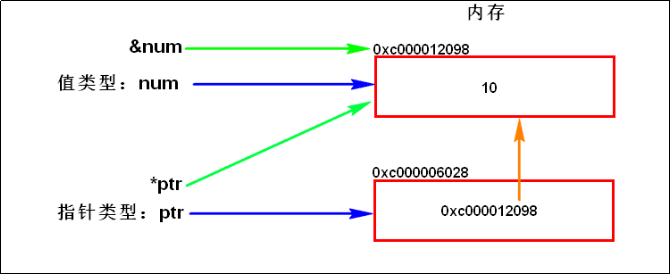

[TOC]

## 变量

### 1 变量的本质

#### 1.1内存的介绍

​		内存是一块存储空间，而且它具有地址编号（可被寻址）。寻址空间一般指的是CPU对于[内存寻址](https://baike.baidu.com/item/内存寻址/1012006)的能力，通俗地说，就是能CPU最多用到多少内存的一个问题。数据在[存储器](https://baike.baidu.com/item/存储器/1583185)(RAM)中存放是有规律的 ，CPU在运算的时候需要把数据提取出来就需要知道数据存放在哪里，这时候就需要挨家挨户的找，这就叫做寻址，但如果地址太多超出了CPU的能力范围，CPU就无法找到数据了。CPU最大能查找多大范围的地址叫做寻址能力 ，CPU的寻址能力以[字节](https://baike.baidu.com/item/字节/1096318)为单位 ，如32位寻址的CPU(32位操作系统)可以寻址2的32次方大小的地址也就是4G，这也是为什么32位的操作系统CPU最大能搭配4G内存的原因 ，再多的话CPU就找不到了。 

#### 1.2 变量的本质

​		变量本质上就是代表一个”**被命名的、可操作的内存空间**”，空间的位置是确定的，但是里面放置什么值不确定。该空间有自己的名称(变量名)和类型(变量类型)。我们可通过变量名来访问“对应的内存空间”，从而操纵这个“内存空间”存储的值。

​		变量和内存之间的关系：

1) 对于编译型的语言，通过**变量声明**来申请(变量类型决定了申请多大的固定大小的连续空间)和命名内存空间(变量名称决定了内存空间的别名）。如golang中的：`var a int`

2) 通过变量名(内存地址的别名)访问内存空间。变量名就是（一段连续）内存空间的别名（是一个门牌号）

3) 变量的值(内存空间存储的值)可以直接或间接地修改

- 直接：通过变量名进行修改。如：a=10

- 间接：内存有地址编号，拿到地址编号也可以修改内存(如指针，一个特殊的变量(内存空间)，存储的其他的内存空间的地址)，如golang中。ptr=&a;*ptr=10

### 2 Golang变量的定义、赋值

#### 2.1 变量声明：

var关键字开头，变量名后指定变量类型。声明后不赋值，则使用默认0值。

```go
var num int  // 不同类型的默认0值是不同的，对int类型的变量会默认初始化为0，对string类型的变量会初始化为空""，对布尔类型的变量会初始化为false，对指针(引用)类型的变量会初始化为nil，等等。
```

批量声明：Golang支持一次性声明多个变量

```go
var n1, n2, n3 int
```

#### 2.2 变量赋值：

对已声明的变量进行赋值：

```go
var num int
num = 10
```

变量声明时，同时对其赋值：

```go
var num int = 20
```

变量类型推导：如果变量声明时直接赋值，可以省略变量的类型，根据值的类型自行判断变量的类型

```go
var num = 10
```

短变量声明（short variable declaration）：**在函数内部**，定义一个或多个变量时，不使用var关键字而使用“:=“ ，并根据它们的初始值为这些变量赋予适当类型的**语句**。

```go
num := 20  	// 上面语句本质上是两条语句var num int；num = 20 ，因为Golang中只有声明语句可以单独存在函数体外，所以上面的语句因为包含赋值语句，只能在函数体内使用。
			// 注意：该方式要求等号左边的变量列表中至少有一个变量未声明。如果所有的变量都已经声明过，则报错，因为同一个作用域内不能重复声明同名变量。 
```

批量声明＋赋值：

```go
var n1, n2, n3 int = 1, 2, 3
var n1, name, n2 = 0, "tom", 3
n1, name, n2 := 0, "tom", 3
var (
    n1 = 3 // PYPE可选，此处，n1后面省略了TYPE
    n2 = 4
    n3 = 5
)
```

#### 2.3 变量使用细节

1)  变量重新赋值时，只能将与变量类型相同的类型的常量赋值给变量名。否则就需要进行类型转换。下面的示例会报错：

```go
var num int = 10
num = "ljzsdut"  //将字符串赋值给int型的变量num会报错
```

２) 变量在同一个作用域内不能重复声明。下面的示例会报错：

```go
var num int = 10
var num string = "ljzsdut"
```

下面也会报错：

```go
var num int = 10
num := 30
```

３) 变量的三要素：变量名+变量类型+变量值

４) Golang中，如果变量名、常量名、函数名的首字母大写，则该名称可以被导出，即可以被别的包访问；如果首字母是小写的，则只能在本包中使用。 这个特性类似于Java的public关键字。

５) Golang变量名建议使用驼峰命名法。形如：“xxxYyyZzz....”

６) 匿名变量：`_,num := 5,6`，将值５赋值给匿名变量'\_'，'\_'`其实就是一个占位符，表示丢弃该变量。因为Golang中，任何定义的变量都必须使用，而且函数可以有多个返回值，如果某个函数返回两个值，而我们只需要使用第二个返回值时，此时就可以使用匿名变量丢弃第一个变量。`_,err := funcTest()`

### 3 Golang值类型和指针类型

Golang中，变量分为**值类型**和**引用类型**：

#### 3.1 值类型

基本的数据类型，变量存的就是值，也叫值类型。通常在栈内存中分配。

> 1. 值类型主要有：int系列、float系列、bool类型、string类型、数组、结构体
> 2. 对于值类型的变量，获取变量的地址，使用&。比如：var num int，获取num的地址：&num

#### 3.2 引用类型

引用类型变量存的是一个地址，这个地址指向的空间存储着值。内存通常在堆内存上分配。比如：`var ptr *int = &num`，其中ptr就是一个指针类型变量，指针类型是引用类型的一种，其类型是*int，表示是一个存放int数据的指针类型，ptr指针本身的值是&num，ptr指针指向的值是变量num的值。

> 1. 引用类型主要有：指针类型（`*TYPE`）、slice切片、map映射、chan管道、interface接口
> 2. 对于指针类型的变量，获取指针变量(地址)所指向的变量，使用。比如：定义指针类型变量 `var ptr *int`  ，使用*prt表示ptr指向的变量的值。
> 3. 指针类型变量大小为1个机器字长(64位操作系统为64bit，即8字节)
> 4. 指针与地址的区别：地址是内存地址，使用字节来描述的内存地址；指针是带类型的。

**new、make关键字**：

```go
func main() {
	var n *int  
	*n = 10  // panic: runtime error: invalid memory address or nil pointer dereference，因为此时变量还没有分配内存，无法进行赋值操作。
	fmt.Println(*n)
}
```

int是一个值类型，*int则表示一个值类型的指针。如果声明一个值类型的指针时，使用new(TYPE)；如果声明一个像slice那样的引用类型的指针，则使用make(TYPE,...)，make在分配内存同时，还会初始化一个引用类型（切片、映射、或通道）指向的对象。所以上例正确的写法如下：

```go
func main() {
	var n = new(int)
	*n = 10
	fmt.Println(*n)
}
```

打印一下地址：

```go
func main() {
	var n *int
	fmt.Println(n)  // <nil>
	n=new(int)
	fmt.Println(n)  // 0xc00000a0c8
	*n = 10
	fmt.Println(*n)
}
```

#### 3.3 值类型与指针类型的内存分析：

```go
func main() {
	var num int = 10                    //定义一个值类型变量
	var ptr *int = &num                 //定义一个指针类型的变量ptr，并将其值设置为num变量的地址。
	fmt.Println("ptr_value:", ptr)      //输出：ptr_value: 0xc000012098
	fmt.Println("ptr_var_value:", *ptr) //输出：ptr_var_value: 10
	fmt.Println("num_addr:", &num)      //输出：num_addr: 0xc000012098
	fmt.Println("ptr_addr:", &ptr)      //输出：ptr_addr: 0xc000006028
}
```

**上例的内存示意图：**



#### 3.4 引用类型的使用示例：交换两个整数变量的值

```go
// 使用指针方式进行交互两个整数的值
// var a *int -->是个指针:表示变量a为一个引用(或称指针),该引用指向一个int类型的数据
//
// *a -->是个数据结构:如果变量a为一个指针,*a表示该指针指向的数据结构
// &a -->是个指针:如果变量a是一个数据结构,&a表示指向止戈数据结构的指针

func swap(a, b *int) {
	tmp := *a
	*a = *b
	*b = tmp
}

func main() {
	a := 100
	b := 200
	swap(&a, &b)
	fmt.Println(a, b)  //200 100

}
```

## 常量

常量是相对于变量而言，常量是恒定不变的值，多用于定义**程序运行期间**不会改变的值。

### **1 **常量的声明与赋值

常量的声明类似于变量的声明，只需要将var关键字替换为const关键字即可。

const关键字开头，常量名后指定数据类型。常量在声明的时候必须进行初始化。常量声明后，其值不可修改。

```go
const pi float64 = 3.1415926
```

常量类型推导：

```go
const pi = 3.1415926
```

批量声明：

```go
const (
	a string = "hello"
	b = 2
	c = 3
	d = 4
)
```

### 2 常量使用细节

(1) 常量表达式的值在编译期计算，而不是在运行期，所以常量值是在编译期就确定的。所以常量的赋值表达式不能使用那些只能在运行期才能确定值的函数。每种常量的潜在类型都是基础类型：boolean、string、数字。

(2) 常量间的所有算术运算、逻辑运算和比较运算的结果也是常量，对常量的类型转换操作返回结果仍是常量；函数`len()、cap()、real()、imag()、complex()、unsafe.Sizeof()`等调用返回值也是常量。

```go
func main() {
	s:=[4]int{1,2,3,4}
	const len = len(s)
	fmt.Println(len)
}
```

(3) 一个常量的声明也可以包含一个类型和一个值，但是如果没有显式指明类型，那么将从右边的表达式推断类型。

(4) 如果是批量声明的常量，除了第一个外其它的常量右边的初始化表达式都可以省略，如果省略初始化表达式则表示使用前面常量的初始化表达式写法，对应的常量类型也一样的。例如：

```go
const (
	a = 1 // 第一行必须给定值，不可省略
	b
	c = 2
	d
)

func main() {
	fmt.Println(a, b, c, d) // "1 1 2 2"
}
```

如果只是简单地复制右边的常量表达式，其实并没有太实用的价值。但是它可以带来其它的特性，那就是iota常量生成器语法。

(5) 常量声明可以使用iota常量生成器初始化，它用于生成一组以相似规则初始化的常量，但是不用每行都写一遍初始化表达式。

常量的初始化规则与枚举：

> 1. 在定义常量组时，如果不提供初始值，则表示将使用上行的表达式。第一行必须给定初始值。
> 2. iota是常量的计数器，可以理解为是const组中每个行的索引号。从0开始，自动递增1。
> 3. 每遇到一个const关键字，iota就会重置为0
> 4. 通过初始化规则与iota可以达到枚举的效果

```go
const (
	Sunday = iota
	Monday
	Tuesday
	Wednesday
	Thursday
	Friday
	Saturday
)
func main(){
	fmt.Println(Sunday, Monday, Tuesday, Wednesday, Thursday, Friday, Saturday) // 0 1 2 3 4 5 6
}
```

```go
const (
	a = iota
	b
	c, d = iota, iota
)

func main(){
	fmt.Println(a, b, c, d) // "0 1 2 2"
}
```

```go
func main() {
	const (
		a='A'
		b
		c=iota
		d
	)
	const (
		aa='A'
		bb=iota
		cc='B'
		dd=iota
	)
	fmt.Println(a,b,c,d) // 65 65 2 3
	fmt.Println(aa,bb,cc,dd) //65 1 66 3
}
```

```go
const (
	n1 = iota	//0
    n2			//1
    _			// 使用_跳过某个值,等同于"_ = iota"
    n3			//3
)
```

```go
const (
	a, b = iota + 1, iota + 2 // 1 2
	c, d                      // 2 3
	e, f                      // 3 4
)
```

iota使用示例：

```go
const (
	_ = iota
	KB = 1 << (10*iota)
	MB = 1 << (10*iota)
	GB = 1 << (10*iota)
	TB
	PB
)

func main(){
	fmt.Println(GB)  //1073741824
	fmt.Println(3*GB)  //3221225472
}
```

(6) 有６种字面值常量是无类型的常量类型（了解）。

​		Go语言的常量有个不同寻常之处。虽然一个常量可以有任意有一个确定的基础类型，例如int或float64，或者是类似time.Duration这样命名的基础类型（通过`const A int = 128` 进行声明常量的基础类型），但是许多常量并没有一个明确的基础类型。这里有６种未明确类型的常量类型，分别是无类型的布尔型、无类型的整数、无类型的字符、无类型的浮点数、无类型的复数、无类型的字符串。编译器为这些没有明确的基础类型的数字常量提供比基础类型更高精度的算术运算；通过延迟明确常量的具体类型，无类型的常量不仅可以提供更高的运算精度，而且可以直接用于更多的表达式而不需要显式的类型转换。

例如，例子中的ZiB和YiB的值已经超出任何Go语言中整数类型能表达的范围，但是它们依然是合法的常量，而且可以像下面常量表达式依然有效（译注：YiB/ZiB是在编译期计算出来的，并且结果常量是1024，是Go语言int变量能有效表示的）：

```go
fmt.Println(YiB/ZiB) // "1024"
```

只有常量可以是无类型的。当一个无类型的常量被赋值给一个变量的时候，或当含有无类型常量的表达式中含有明确类型的值，无类型的常量将会被隐式转换为对应的类型，如果转换合法的话。例如：

```go
var f float64 = 212 // untyped integer -> float64
fmt.Println((f - 32) * 5 / 9) // untyped integer -> float64

var f float64 = 3 + 0i // untyped complex -> float64 等价于var f float64 = float64(3 + 0i)
f = 2 // untyped integer -> float64 等价于 f = float64(2)
```


 