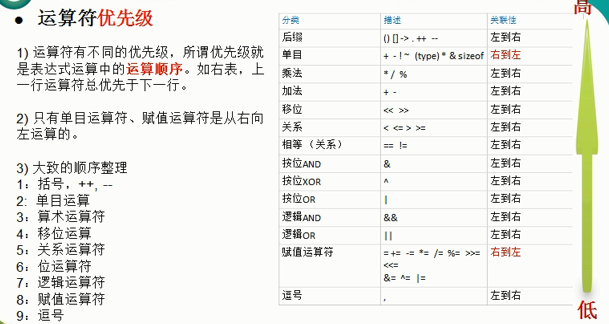

[TOC]

## 运算符

### 1 算术运算符

算术运算符主要是对数值型变量进行运算。比如加减乘除等。golang的算术运算符中没有乘方的运算，可以使用`math.Pow(m,n)`计算m的n次方。

**注意事项：**

1. 如果要使结果为浮点型，则除数和被除数至少有一个为浮点数。

```GO
(1) 5 / 2 => 2     // 取整数部分，去掉小数部分，不是四舍五入。例如本例的2.5取值为2
(2) 5.0/2 => 2.5
(3) 5/2.0=> 2.5
(4) 5.0/2.0=> 2.5
```

2. 除号两边的变量类型要一致，否则需要进行转换，包括兄弟类型也要转换。(常量是无类型的)

```go
var n1 int8 = 25
var n2 int16 = 5
fmt.Println(n1 / n2) //invalid operation: n1 / n2 (mismatched types int8 and int16)
```

3. Golang中取余的结果中的正负号与被除数一致。例如：

```go
(1) 10 % 3 => 1
(2) 10 % -3 => 1
(3) -10 % 3 => -1
(4) -10 % -3 => -1
```

4. Golang中，不存在`++i`和`--i`的运算，而且`i++`和`i--`只能独立使用，不能将其赋值给一个变量。例如`a := i++`和`i++ > 0`的形式是不正确的。

```go
(1) i++等价于i = i + 1
(2) i--等价于i = i - 1
```

### 2 关系运算符

1. 关系运算符主要有==、！=、<、>、<=、>= 。
2. 关系运算符的结果都是bool型的，也就是要么是true，要么是false；
3. 关系运算符组成的表达式我们称之为“关系表达式”。关系表达式经常用在if结构的条件中或循环结构的条件中。也可以用在复制语句中，例如`flag := n1 < n2`

### 3 逻辑运算符

1. 逻辑运算符用来连接多个条件（一般为关系表达式），最终结果是一个bool型。

2. 逻辑运算符主要有：逻辑与&&、逻辑或||、逻辑非！

   示例：`if a > 20 && b < 30 {}`

3. 逻辑与、逻辑或运算符都有短路特性。&&的短路表示如果第一个条件为false，后续的条件就无需再进行判断，最终结果就为false；||的短路表示如果第一个条件为true，则最终结果为true。

4. 逻辑运算符使用的过程中，为了避免出现误解，我们可以使用小括号来进行优先级的明确。例如!((age < 30)

### 4 赋值运算符

赋值运算符	就是将某个运算的值赋值给指定的变量。

| 赋值运算符 | 描述                                           | 示例                            |
| ---------- | ---------------------------------------------- | ------------------------------- |
| =          | 简单的赋值运算符，将一个表达式的结果给一个左值 | C=A+B，将A+B表达式的结果赋值给C |
| +=         | 相加后再赋值给左值                             | C+=A等价于C=C+A                 |
| -=         | 相减后再赋值给左值                             | C-=A等价于C=C-A                 |
| *=         | 相称后再赋值给左值                             | C*=A等价于C=C*A                 |
| /=         | 相除后再赋值给左值                             | C/=A等价于C=C/A                 |
| %=         | 取余后再赋值给左值                             | C%=A等价于C=C%A                 |
|            | 《位相关的赋值运算符》：                       |                                 |
| <<=        | 左移后赋值                                     | C<<=2等价于C=C<<2               |
| >>=        | 右移后赋值                                     | C>>=2等价于C=C>>2               |
| &=         | 按位与后赋值                                   | C&=2等价于C=C&<2                |
| ^=         | 按位异或后赋值                                 | C^=2等价于C=C^2                 |
| \|=        | 按位或后赋值                                   | C\|=2等价于C=C\|2               |

### 5 其他运算符

1. 取地址符：&    var a int    取变量a的地址：&a

2. 指针取值符：*    var a *int   取指针变量a指向的变量：*a

> 说明：Golang不支持三元运算符。如果要实现三元运算符，可以通过if-else语句。

##  运算符优先级

